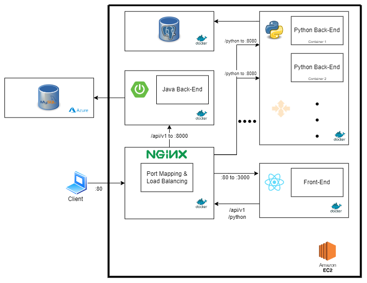

# Book Portal


<hr>

## Build Status

[](https://github.com/HacettepeCSCoders/Online-Data-Scientist/actions/workflows/nodeJS.yml)

[](https://github.com/HacettepeCSCoders/Online-Data-Scientist/actions/workflows/maven.yml)

[](https://github.com/HacettepeCSCoders/Online-Data-Scientist/actions/workflows/pyt.yml)

[](https://github.com/HacettepeCSCoders/Online-Data-Scientist/actions/workflows/ec2.yml)

## Project title
Online Data Scientist 📚 using React, Spring Boot, Python

### Motivation
The Online Data Scientist project is designed to provide a comprehensive platform for data analysis and machine learning tasks.

The motivation behind the Online Data Scientist project is to create a user-friendly and efficient environment for performing data analysis tasks. By combining the capabilities of React for the front-end, Java for user-related operations, Python for data science tasks, and Nginx for load balancing, the project aims to streamline the data analysis process and provide accurate statistical test results and machine learning scores.

## Solution
The project aims to enable users to perform data analysis, statistical tests, and machine learning algorithms by leveraging the power of React, Java, Python, and related libraries.

### Database diagram (MySQL)


### Architecture


### Project Components

- Front-end (React): The front-end layer of the project is responsible for providing a user-friendly interface through which users can interact with the application. It handles the presentation logic and user input, sending requests to the back-end layers for data processing, statistical tests, ML, and retrieval.

- Java Backend: The Java backend layer focuses on user-related operations, handling tasks such as user authentication, authorization, and managing user-specific data. It communicates with the front-end layer to receive user requests and processes them accordingly.

- Python Backend: The Python backend layer plays a crucial role in performing data science tasks. It receives selected parameters from the front-end, along with CSV and XLSX files, and conducts statistical tests and machine learning algorithms using the specific libraries. The results, including scores and relevant data, are then sent back to the front-end.

- Nginx: Nginx is utilized for port mapping and load balancing. It serves as a reverse proxy, directing incoming requests to the appropriate backend layer based on the request path. It ensures efficient load distribution and high availability by implementing load balancing algorithms such as round-robin.

## Installation

### How to use it?

- #### Deployed website

Steps

1. Go to the link : http://online-data-scientist.xyz (alternative : http://16.171.19.190)
2. Use it :)

- #### GitHub

You will need Docker and Docker-Compose plugin.

Steps

1. Clone the repo https://github.com/HacettepeCSCoders/Online-Data-Scientist
2. Go to the project folder
3. Type ``` docker-compose up ``` for creating containers and run them
4. Type ``` docker-compose up --scale py={desired instance amount} ``` for creating containers with multiple py instance and run them
4. Voilà app up and running ! (localhost:80)

<hr>